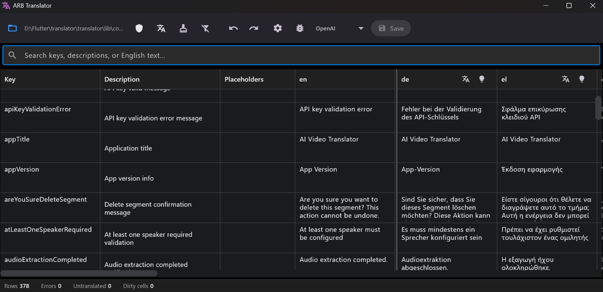

<h1>ARB Translator</h1>

<strong>Fast Windows\Linux desktop tool for managing and AI‑assisting Flutter <code>.arb</code> translations.</strong>

---

## Why Use It?
Tired of juggling multiple `.arb` files, guessing what is untranslated, or fixing runtime placeholder errors? ARB Translator puts every locale key in one clean grid, validates placeholders instantly, tracks edits precisely, and can auto‑translate safely with AI.

## What You Get
Focused benefits:

* One merged view of all locales
* Guaranteed metadata consistency (only in base `en` file)
* Instant placeholder mismatch warnings
* Clear progress: counters for Errors / Untranslated / Dirty
* Safe bulk & per‑cell AI translation (placeholders preserved)
* Undo / Redo for edits, renames, deletions
* Deterministic save (sorted keys, stable diffs)
* Orphan / empty English key cleanup
* Fast on large projects (5k+ rows)

## Core Features
* Inline multi‑line editing
* Bulk translate column: All or Only Empty
* Per‑cell translate button
* Live search (by key)
* Filters: Errors, Untranslated
* Dirty & error highlighting per cell & locale header
* Undo / Redo stack cleared after successful save
* Keyboard shortcuts: Ctrl+S / Z / Y, F2 (edit hook)
* Cancellable batch translation with progress
* Secure (not logged) API key usage + glossary prompt support

## AI Translation
* Preserves `{placeholders}` strictly
* Optional glossary bias
* Retry (up to 3 attempts) on transient errors
* Bulk mode skips already filled cells when you pick “Only Empty”

## Placeholder Safety
Every edit or AI result re‑checks placeholder sets vs English. Any difference = highlighted error + filterable.

## Cleanup Tools
* Remove orphan keys (not in base file)
* Remove empty-English keys

## Roadmap (Short)
* Expanded editor dialog
* Add/remove locale stubs
* Dirty-only filter
* Multi‑provider AI strategy selector
* Diff / report export

## License
GPLv3 – see [LICENSE](./LICENSE).

## Disclaimer
AI output may require human review. Do not send sensitive data to external APIs.

---
Enjoy faster, safer localization. 🚀

