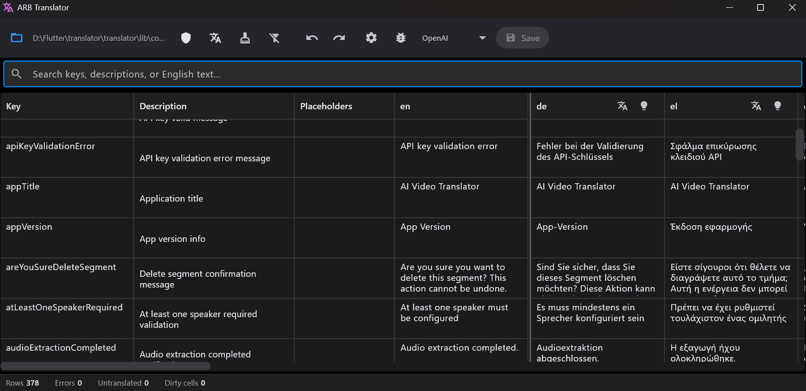

<h1>ARB Translator</h1>

<strong>Fast Windows\Linux desktop tool for managing and AI‑assisting Flutter <code>.arb</code> translations.</strong>

---

## Why Use It?
Tired of juggling multiple `.arb` files, guessing what is untranslated, or fixing runtime placeholder errors? ARB Translator puts every locale key in one clean grid, validates placeholders instantly, tracks edits precisely, and can auto‑translate safely with AI.

## What You Get
Focused benefits:

* One merged view of all locales
* Guaranteed metadata consistency (only in base `en` file)
* Instant placeholder mismatch warnings
* Clear progress: counters for Errors / Untranslated / Dirty
* Safe bulk & per‑cell AI translation (placeholders preserved)
* Undo / Redo for edits, renames, deletions
* Deterministic save (sorted keys, stable diffs)
* Orphan / empty English key cleanup
* Fast on large projects (5k+ rows)

## Core Features
* Inline multi‑line editing
* Bulk translate column: All or Only Empty
* Per‑cell translate button
* Live search (by key)
* Filters: Errors, Cells to translate (empty or source changed)
* Dirty & error highlighting per cell & locale header
* Undo / Redo stack cleared after successful save
* Keyboard shortcuts: Ctrl+S / Z / Y, F2 (edit hook)
* Cancellable batch translation with progress
* Secure (not logged) API key usage + glossary prompt support

## AI Translation
* Preserves `{placeholders}` strictly
* Optional glossary bias
* Retry (up to 3 attempts) on transient errors
* Bulk mode skips already filled cells when you pick “Only Empty”

## Placeholder Safety
Every edit or AI result re‑checks placeholder sets vs English. Any difference = highlighted error + filterable.

## Source Change Tracking
* Automatically detects when source (English) text has changed using SHA-256 hashing
* Every ARB file (including translated locales) stores `"sourceHash"` in the `@key` annotation — the SHA-256 of the English string **at save time**, so staleness can be detected without the English file
* Shows ⚠️ icon next to keys with modified source text
* Displays count of changed source keys in stats panel
* Bulk translate **"Only Empty"** automatically re-translates keys with a changed source too — no need to re-translate by hand after editing English strings
* **"Cells to translate" filter** — shows all cells that need attention: empty translations and translations whose source text has changed (detected via SHA-256), so you always know exactly what to work on next
* "Commit Source Hashes" button to mark all hashes as confirmed after reviewing changes
* Helps identify which translations need updating after source text modifications

## Cleanup Tools
* Remove orphan keys (not in base file)
* Remove empty-English keys

## Roadmap (Short)
* Expanded editor dialog
* Add/remove locale stubs
* Dirty-only filter
* Multi‑provider AI strategy selector
* Diff / report export

## License
GPLv3 – see [LICENSE](./LICENSE).

## Disclaimer
AI output may require human review. Do not send sensitive data to external APIs.

---
Enjoy faster, safer localization. 🚀

